# PICTURES AND PLACES

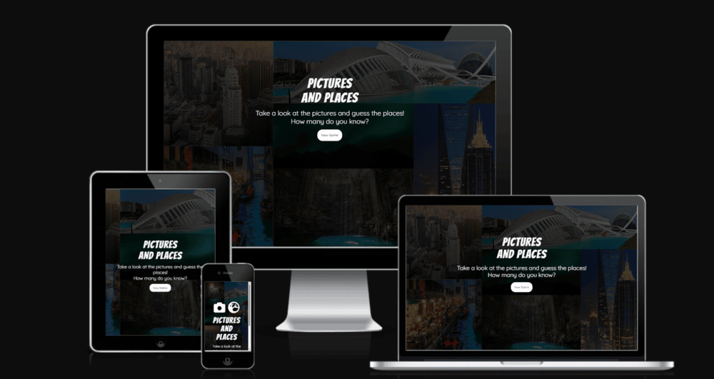

Visit the deployed website: https://alelodato.github.io/Pictures-and-Places/;

Pictures And Places is an interactive quiz game made for anyone who loves travels and geography and want to test their knowledge.
Users on this website can participate to a quiz game showing 10 questions with a related picture to each one of them. The users are requested to guess where the place shown in the picture is located, and to do that is provided with 4 possible answers. A correct or incorrect answer is going to be registered with a score tracker at the bottom left of the page so that the users can keep track of their progresses throughout the game, and at the end of it, they will receive a feedback with the number of correct answers, and are given the chance to play again.

## DESIGN

### COLOUR SCHEME:

As the website is made for a geography quiz game, i wanted to give it a light and colourful mood, but still keeping it simple to provide a good user experience.

* For the quiz introduction and final message text content i have used the colour  #fafafa;
    
* For the cover text i have used the colour rgb(22, 97, 72,0.9);

* For the buttons i have used the colour #000000 for the text content and #a8cccc for the background;

* For the questions, answers button and score tracker text content i have used the colour #000000;

* For the answers buttons background colour i have used #1cd0b2;

* For the answers buttons when hovered,i have used the colour #e2f0ed;

### TYPOGRAPHY

All the fonts are imported from Google Fonts.
The Fonts imported are "Kaushan Script" and "Shadows Into Light".

* The font "Kaushan Script" is the font i have used for the heading of the game website. Is a font that looks great for a headline,is in cursive to make it a bit lighter and i think goes well with the mood of a geography quiz game;

* The font "Shadows Into Light" is the font i used for the pages paragraphs,the questions,the answers and the button text content,it is as the headline font very light, and it goes well with the mood i wanted to give to the quiz game.

### IMAGERY AND VIDEOS

As the website is for a geography quiz game, i wanted to give it a backround image showing what could be a beautiful and peaceful turistic place as a tropical beach can be. I also thought that showing images of the places the user has to guess was fundamental, and makes the quiz itself much more interesting. For this purpose i used a background image and 10 different images related to each of the specific questions, the images are all from the Pexels website.

### WIREFRAMES
 
Wireframes were created for mobile,tablet and desktop using Balsamiq.

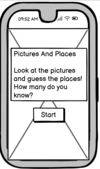 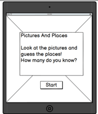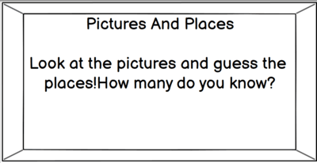

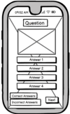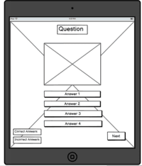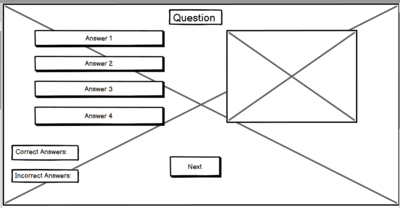

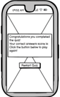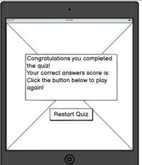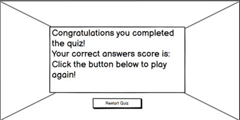

## FEATURES

### NAVIGATION:

The website features 4 different buttons to navigate it. The first one is the start button, located under the website intro text content, it allows the user to start the quiz game, hiding and making the quiz game appear when pressed.The second button is the next button, located under the quiz section, allows the user to progress to the next question of the game. The third button is the finish button,which is gonna appear instead of the next button when the user reaches the last question of the game. The finish button is gonna end the quiz game and hides the quiz game content showing results and an end of the game message to the user.The last button that can be found is the play again button, which allows the player to start a new quiz game.

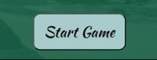
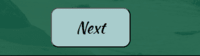
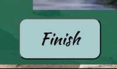
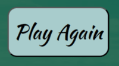

### THE HEADER:

The Header is the logo of the game and the title of website page. The header is shown as an introduction to the website for the user, with an intro paragraph below; 

### INTRO PARAGRAPH:

The Intro paragraph is below the header,and is a paragraph that introduces the user to the website, giving a brief explanation of what the game is about;  

The color of the cover text is : rgb(22, 97, 72,0.9);

### THE QUIZ GAME:

The quiz game,appears when pressing the start button and has few different features:

#### THE QUESTIONS

These are the questions of the quiz game, there are 10 of them and are shown at the top of the page:

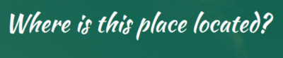

#### THE QUIZ IMAGES

The images that are shown for each related question. The quiz images are shown on the right side, opposite to the answer options, on laptops and larger screen devices, while are shown right under the question, and on top of the answer options on tablets and mobiles.

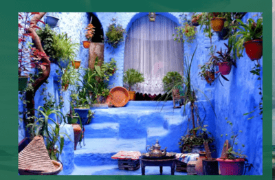

#### THE ANSWER OPTIONS:

The answer options are 4, shown on a column and on the left side of the page on laptop and larger screens, while are shown below the quiz images on tablets and mobile screens.

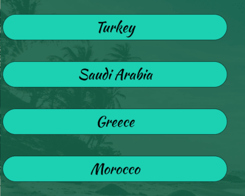

#### THE SCORE TRACKER;

The score tracker keeps track of the correct and incorrect answers provided by the user during the quiz game.
It's located on the bottom left side of the page.

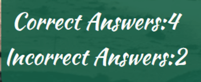

### THE INFO FEEDBACK MESSAGE:

This is a pop up message that appears after the user enters an answer. This feedback message is going to tell the user if the answer entered is right or wrong, and it's going to show some infos about the place featured in the question.I decided to use a pop up alert as the game page is quite full of content itself, and i think a pop up alert keeps it quite clear and easy to read, not going in conflict with the rest of the content in the quiz game, keeping the user experience and accessibility good.

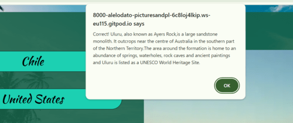

### THE GAME END MESSAGE:

The game end message, appears after the user submits the last answer, and press the finish button.
This message is made to let the user know that the quiz has been completed, and to give a feedback about the correct answers scored. 

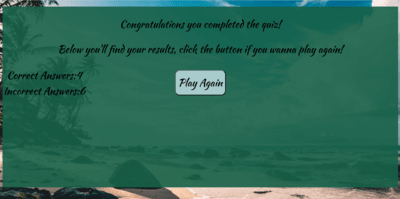

## TECHNOLOGIES USED

* [Balsamiq](https://balsamiq.com/) - Used to create wireframes.

* [Github](https://github.com/) - To save and store the files for the website.

* [GitPod](https://gitpod.io/) - IDE used to create the site.

* [Google Fonts](https://fonts.google.com/) - To import the fonts used on the website.

* [Google Developer Tools](https://developers.google.com/web/tools) - To troubleshoot and test features, solve issues with responsiveness and styling.

* [Pexels](https://www.pexels.com/) - To get all the images and videos needed for the website.

* [Image Resizer](https://imageresizer.com/) To compress,resize,and convert images to webp format.

* [Font Awesome](https://fontawesome.com/) To get the website icons.

* [Favicon.io](https://favicon.io/) To create the website favicon.

* [Am I Responsive?](http://ami.responsivedesign.is/) To show the website image on a range of devices.

## TESTING

Testing was ongoing throughout the entire build. I utilised Chrome developer tools whilst building to pinpoint and troubleshoot any issues as I went along.

During development I made use of google developer tools to ensure everything was working correctly and to assist with troubleshooting when things were not working as expected.

I have gone through each page using google chrome developer tools to ensure that each page is responsive on a variety of different screen sizes and devices.

- - -

## AUTOMATED TESTING

### W3C Validator

[W3C](https://validator.w3.org/) was used to validate the HTML on all pages of the website. It was also used to validate the CSS.

* index.html - Passed.
* style.css - Passed, no errors found.
* script.js - Passed.
* questions.js - Passed.

- - -

### Lighthouse

I confirm that all the pages of the website perform well and that the colors and fonts chosen are easy to read and accessible by running it through Lightouse in devtools:

## MANUAL TESTING

Full testing was performed on the following devices:

* Laptop:
  * ASUS Vivobook S14
* Mobile Devices:
  * iPhone 14.
  * Samsung S22

  Each device tested the site using the following browsers:

* Google Chrome
* Safari
* Firefox
* Microsoft Edge

`Features Manual Testing`

| Feature | Expected Outcome | Testing Performed | Result | Pass/Fail |
| --- | --- | --- | --- | --- |
| The Start Button | Button starts the quiz game | Clicked button | Quiz Game Starts | Pass |
| The Start Button | Button hides intro text content and shows quiz game content| Clicked on the button | Intro text content hidden,quiz game content shown | Pass |
| Answer Buttons | Buttons recognise correct and incorrect answers | Clicked on button| Button turns green if answer is correct,wrong if answer is incorrect and respective alerts are shown | Pass |
| Next Button | Button shows next question when pressed | Clicked on the button | Next question shows | Pass |
| Quiz questions showing correctly | Each quiz question need to show in random order with respective answer options and quiz image | Press start or next button | The quiz questions are showing in random order with respective image and answer options | Pass |
| Score Tracker | Keeps track of correct and incorrect answers submit by the user | Answer correct or incorrect answer | Score tracker counter updated | Pass |
| Info Alerts | Alert show if answer is correct or incorrect with question related infos| Amswer question | Correct alert message shown | Pass |
| Finish Button | Button appears on the last question | Clicked next button to last question | Next button hidden, finish button shown | Pass |
| Finish button | End game when pressed, showing quiz result message | Clicked on button | Quiz game ends, result message shown | Pass |
|  Quiz Result Message | The message should show the number of correct answer submit by the user | Press finish button to show quiz result message | The message shows the right number of correct answers | Pass |
| Play Again Button | The button should allow the user to start a new game | Click on button | New game starts | Pass |

### BUGS

## DEPLOYMENT

The site was deployed to GitHub pages.
The steps to deploy are as follows:
1. Login (or signup) to Github.
2. Go to the repository for this project, [alelodato/Pictures-And-Places](https://github.com/alelodato/Pictures-and-Places).
3. Click the settings button.
4. Select pages in the left hand navigation menu.
5. From the source dropdown select main branch and press save.
6. The site has now been deployed, please note that this process may take a few minutes before the site goes live.

#### How to Fork

To fork the repository:

1. Log in (or sign up) to Github.
2. Go to the repository for this project, [alelodato/Pictures-And-Paces](https://github.com/alelodato/Pictures-and-Places)
3. Click the Fork button in the top right corner.

#### How to Clone

To clone the repository:

1. Log in (or sign up) to GitHub.
2. Go to the repository for this project, [alelodato/Pictures-And-Places](https://github.com/alelodato/Pictures-and-Places)
3. Click on the code button, select whether you would like to clone with HTTPS, SSH or GitHub CLI and copy the link shown.
4. Open the terminal in your code editor and change the current working directory to the location you want to use for the cloned directory.
5. Type 'git clone' into the terminal and then paste the link you copied in step 3. Press enter.

- - -

## CREDITS
    
All the icons used for the toggle menu,the reasons section,the footer and the website favicon,were taken from the [Font Awesome](https://fontawesome.com/) website;

The font used in the website,"Bebas Neue" and "Urbanist",were taken from [Google Font](https://fonts.google.com/);

All the background images and the reasons section video,were taken from the [Pexels](https://www.pexels.com/) website.